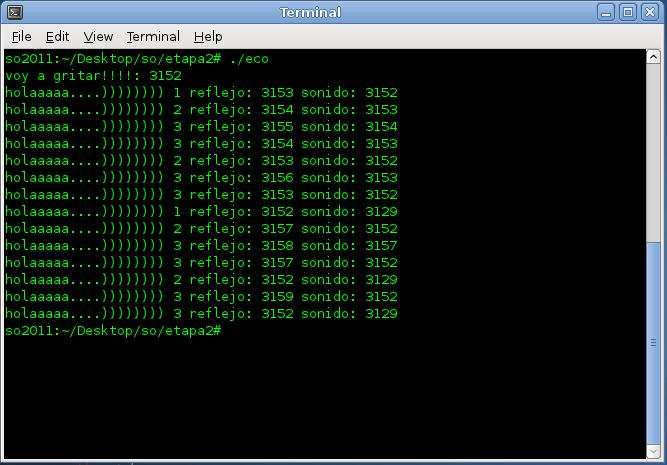
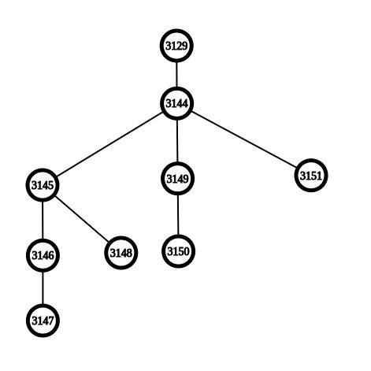

# Argumentos por línea de comandos (argv - argc - opciones)
# Ejercicio 1:
## rectangulo.c:
```c
#include <getopt.h>
#include <stdbool.h> //bool
#include <stdio.h>
#include <stdlib.h> //exit 

int main (int argc, char **argv)
{
  bool mostrarArea = false;
  bool mostrarPerimetro = false;
  int c;
  int lado = -1;
  int base = -1;


  while ((c = getopt (argc, argv, ":apl:b:")) != -1)
    switch (c)
    {
    case 'a':
      mostrarArea = true;
      break;
    case 'p':
      mostrarPerimetro = true;
      break;
    case 'l':
      lado = atoi(optarg);
      break;
    case 'b':
      base = atoi(optarg);
      break;
    case '?':
      printf("Opción inválida: %c\n", optopt);
      exit(1);
      break;
    }

  if (lado <= 0 && base <= 0) {
    printf("-l y -b son obligatorios y necesitan argumentos positivos!\n");
    exit(1);
  }
  if (lado <= 0 ) {
    printf("-l es obligatorio y necesita un argumento positivo!\n");
    exit(1);
  }
  if (base <= 0 ) {
    printf("-b es obligatorio y necesita un argumento positivo!\n");
    exit(1);
  }
  if (mostrarArea) printf("Area: %d\n", lado * base);
  if (mostrarPerimetro) printf("Perimetro: %d\n", lado * 2 + base * 2);

  return 0;
}
```
\pagebreak
 
# Gestión de procesos
# Ejercicio 2:
## tejidos.c:
```c
//~ #include <sys/types.h>
#include <stdlib.h> //exit
#include <unistd.h> //getpid execve
#include <stdio.h>
//~ #include <string.h>

int main(int argc, char *argv[], char *envp[]) {

	if (argc != 2) {
		printf("El programa acepta solo un parámetro\n");
		exit(1);
	}

	printf("Procesamiento de tejido: %d\n", getpid());

	execve("celulas", argv, envp);

	return 0;
}
```
## celulas.c:
```c
#include <stdio.h>
#include <stdlib.h> //atoi
#include <unistd.h> //getpid

void binario (int n);

int main (int argc, char *argv[]) {

	int n = atoi(argv[1]);

	binario(n);
	printf(" Tejido %d regenerado\n", getpid());

	return 0;
}

void binario (int n) {
	int mod = n % 2;
	if (n / 2 > 0) {
		binario(n / 2);
		printf("%d", mod);
	} else {
		printf("%d", mod);
	}
}
```
# Ejercicio 3:
## produc.c:
```c
#include <stdio.h>
#include <stdlib.h> //atoi rand srand
#include <sys/unistd.h> //fork getpid getppid sleep
#include <sys/wait.h> //wait
#include <time.h> //time


int main (int argc, char *argv[]) {

	int parametro = atoi(argv[1]);
	int tiempo, i;
	pid_t pid;
	srand (time (NULL));


	if ((pid = fork()) == 0) {
		printf("INICIO MAQUINA A: %d\n", getppid());
		printf("MAQUINA B %d\n", getpid());


		for (i = 0; i < 7; i++) {
			tiempo = rand() % 6;
			sleep(tiempo);
			printf("Trabajo realizado %d por MAQ B - time %d\n", i, tiempo);
		}
	}
	else {

		if (parametro != 1) {
			for (i = 0; i < 7; i++) {
				tiempo = rand() % 6;
				sleep(tiempo);
				printf("Trabajo realizado %d por MAQ A - time %d\n", i, tiempo);

			}
		}
		else {
			printf("MAQUINA A aguardando termine MAQUINA B.\n");
			wait(NULL);
			printf("MAQUINA A recibe aviso MAQUINA B ha concluido - Inicia a operar MAQUINA A\n");
			for (i = 0; i < 7; i++) {
				tiempo = rand() % 6;
				sleep(tiempo);
				printf("Trabajo realizado %d por MAQ A - time %d\n", i, tiempo);
			}
		}
	}

	return 0;
}
```
# Ejercicio 4:
## eco.c:
```c
#include<stdio.h>
#include<unistd.h> //fork getpid getppid

int main (int argc, char *argv[]) {
	int i;

	printf("voy a gritar!!!!: %d\n", getpid());
	for (i = 1; i < 4; i++) {
		fork();
		printf("holaaaaa....)))))))) %d reflejo: %d sonido: %d \n", i, getpid(), getppid());
	}

	return 0;
}
```
\pagebreak
 
## Salida eco.c
{ width=400px } \
 
## Esquematización en forma de árbol
Cantidad de procesos generados: 8
 
{ width=400px } \
\pagebreak
 
# Gestión de archivos, directorios y sistemas de archivos + señales
# Ejercicio 5:
## buscador.c:
```c
#include <dirent.h> //opendir readdir
#include <signal.h> //kill SIGUSR1
#include <stdio.h>
#include <stdlib.h> //atoi
#include <sys/stat.h> //stat DIR
#include <unistd.h> //sleep close


int main(int argc, char* argv[]) {
	int pid = atoi(argv[1]);
	DIR *dir;
	dir = opendir(argv[2]);
	struct dirent *ptr;
	struct stat st;

	if (dir != NULL) {
		while ((ptr = readdir(dir))) {
			stat((ptr->d_name), &st);
			if (S_ISREG(st.st_mode)) {
				printf(ptr->d_name);
				int tam = st.st_size;
				if (tam < 1024) {
					kill(pid, SIGUSR1);
					printf(" - Regular\n");
				}
				if (tam > 1024) {
					kill(pid, SIGUSR2);
					printf(" - Regular size > 1 KB %d\n", tam);
				}
			}
			sleep(1);
		}
	} else {
		printf("El directorio ingresado no existe.\n");
	}

	closedir(dir);

	return 0;
}
```
## monitor.c:
```c
#include <signal.h> //signal
#include <stdio.h>
#include <unistd.h> //pause

int sigT = 0;
int sig1 = 0;
int sig2 = 0;

void manejador1 (int sig);
void manejador2 (int sig);

int main() {

	signal(SIGUSR1, &manejador1);
	signal(SIGUSR2, &manejador2);
	while (sigT != 15) pause();


	return 0;
}

void manejador1 (int sig) {
	sigT++;
	sig1++;
	printf("Acumulado de archivos regulares menores a 1 K: %d\n", sig1);
}
void manejador2 (int sig) {
	sigT++;
	sig2++;
	printf("Acumulado de archivos regulares mayores a 1 K: %d\n", sig2);
}
```
\pagebreak
 
# Redirección de entrada y salida
# Ejercicio 6:
## isbn.c:
```c
#include <stdio.h>
#include <unistd.h>

int main(int argc, char * argv[]) {

    char buffer[1];
    int isbn = 3025;

    while ((read(0, buffer, 1)) != 0) {

        if (buffer[0] != '\n')
            printf("%c", buffer[0]);

        else {
            printf(" %d\n", isbn);
            isbn = isbn + 1;
        }
    }
    return 0;
}
```
## editorial.c:
```c
#include <stdio.h>
#include <unistd.h> //read

int main(int argc, char * argv[]) {

	char buffer[1];


	while ((read(0, buffer, 1)) != 0) {

		if (buffer[0] != '\n')
			printf("%c", buffer[0]);

		else
			printf(" Tulibro SA\n");
	}

	return 0;
}
```
## imprenta.c:
```c
#include <errno.h> //errno
#include <fcntl.h> //open 
#include <getopt.h>
#include <stdbool.h> //bool
#include <stdio.h>
#include <stdlib.h> //exit
#include <string.h> //strcpy
#include <sys/stat.h> //chmod
#include <unistd.h> //pipe dup execve close fork

void mostrarError(char palabra[]);
void procesarEntrada(char libros[20], char imprimir[20], int argc, char * argv[]);


int main(int argc, char * argv[]) {

    char libros[20];
    char imprimir[20];

    procesarEntrada(libros, imprimir, argc, argv);

    int fd1, fd2;
    pid_t pid;
    int tuberia[2];
    pipe(tuberia);


    switch (pid = fork()) {
    case -1:
        mostrarError("ProcesoISBN");
        break;

    case 0:
        fd1 = open(libros, O_RDONLY);
        if (fd1 == -1) mostrarError(libros);
        close(0);
        dup(fd1);

        close(1);
        dup(tuberia[1]);

        close(tuberia[0]);
        execve("isbn", argv, 0);
    }

//------------------------

    switch (pid = fork()) {
    case -1:
        mostrarError("ProcesoEditorial");
        break;

    case 0:
        fd2 = open(imprimir, O_CREAT + O_WRONLY);
        if (fd2 == -1) mostrarError(imprimir);
        close(0);
        dup(tuberia[0]);

        close(1);
        dup(fd2);

        close(tuberia[1]);
        chmod(imprimir, 0666);
        execve("editorial", argv, 0);
    }

    return 0;
}

void procesarEntrada(char libros[20], char imprimir[20], int argc, char * argv[]) {

    int c;
    bool l, i = 0;

    while ((c = getopt(argc, argv, ":l:i:")) != -1) {
        switch (c) {

        case 'l':
            l = 1;
            strcpy(libros, optarg);
            break;

        case 'i':
            i = 1;
            strcpy(imprimir, optarg);
            break;
//~ 
        //~ case ':':
            //~ printf("La opción necesita un valor\n");
            //~ exit(1);
            //~ break;

        case '?':
            printf("Opción inválida: %c\n", optopt);
            exit(1);
            break;
        }
    }

    if (!l) {
        printf("-l es obligatorio y necesita un valor!\n");
        exit(1);
    }
    if (!i) {
        printf("-i es obligatorio y necesita un valor!\n");
        exit(1);
    }

}


void mostrarError(char palabra[]) {
    printf("Error número: %d\n", errno);
    perror(palabra);
    exit(1);
}
```
\pagebreak
 
# Descargos
## Argumentos por línea de comando (argc - argv - opciones)
- Ejercicio 1: rectangulo.c

***

## Gestión de procesos
- Ejercicio 2: tejidos.c y celulas.c

- Ejercicio 3: produc.c

- Ejercicio 4: eco.c

***

## Gestión de archivos, directorios y sistemas de archivos + señales
- Ejercicio 5: buscador.c y monitor.c

***

## Redirección de entrada y salida
- Ejercicio 6: isbn.c, editorial.c e imprenta.c
  - Asumimos que el archivo libros.txt contiene un salto de linea (carriage return) al final.\pagebreak
 
# Bibliografía
https://www.gnu.org/software/libc/manual/html_node/Miscellaneous-Signals.html

https://cboard.cprogramming.com/c-programming/133346-determine-file-type-linux.html

https://linux.die.net/man/3/readdir

https://stackoverflow.com/questions/238603/how-can-i-get-a-files-size-in-c

http://codewiki.wikidot.com/c:system-calls:open

https://www.geeksforgeeks.org/input-output-system-calls-c-create-open-close-read-write/

https://stackoverflow.com/questions/21666050/c-finding-newline-chartacters-in-my-buffer-from-a-read-system-call

https://www.geeksforgeeks.org/getopt-function-in-c-to-parse-command-line-arguments/

https://cboard.cprogramming.com/c-programming/111914-getopt-parsing-string-argument.html
